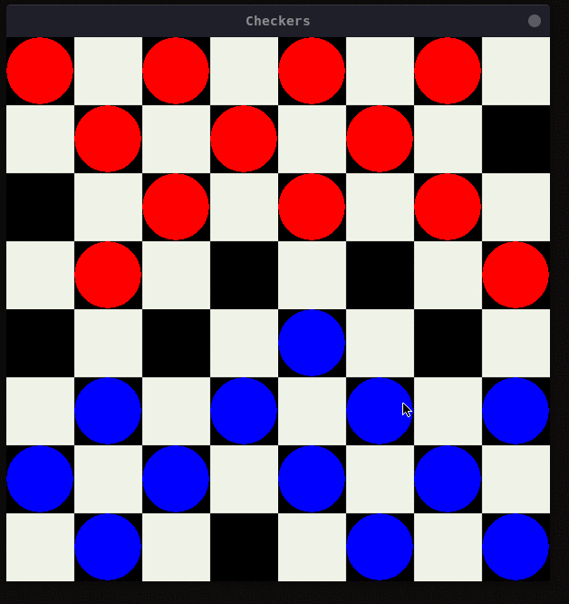
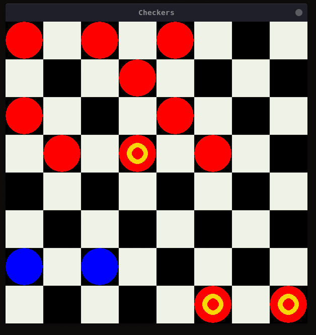
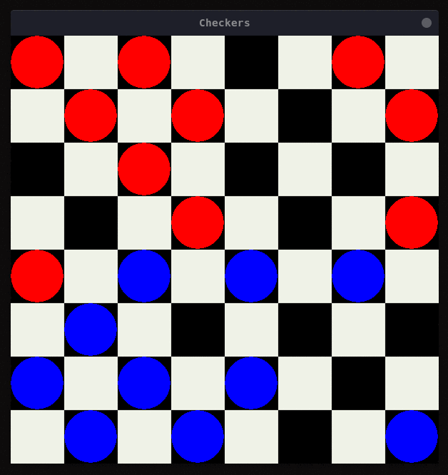
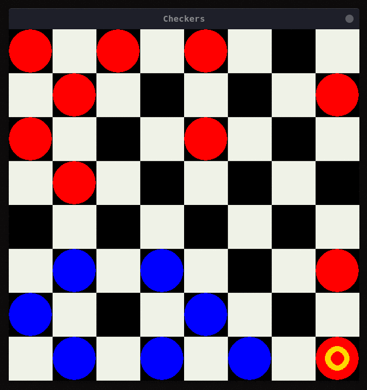

# CHECKERS GAMING

## Introduction

The game of checkers is considered a complicated game with  possible legal positions in the English draughts version (  board) alone (much more on higher dimensions). In this attempt to create a game agent, a tree traversal approach has been used. This approach is not only fast but also efficient given that good heuristics are used. The agent has been created which is capable of playing the game of checkers with a remarkable win rate against average players. Checkers is a 1vs1 zero-sum game. Minimax or Minimax algorithm is best suited for such types of games. Following is the development procedure practised during the development of the project.

1. Implemented a basic Minimax Agent with limited depth.
2. Applied ⍺-β pruning.
3. Improved the evaluation functions.

<table>
    <tr>
        <td></td>
        <td></td>
    </tr>
    <tr>
        <td></td>
        <td></td>
    </tr>
</table>

## Contributing

Found a bug? Create an **[issue](https://github.com/Hsankesara/Draughts-AI/issues/new)**.
